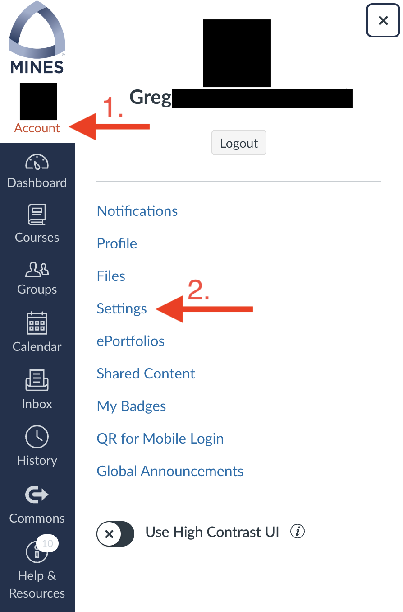
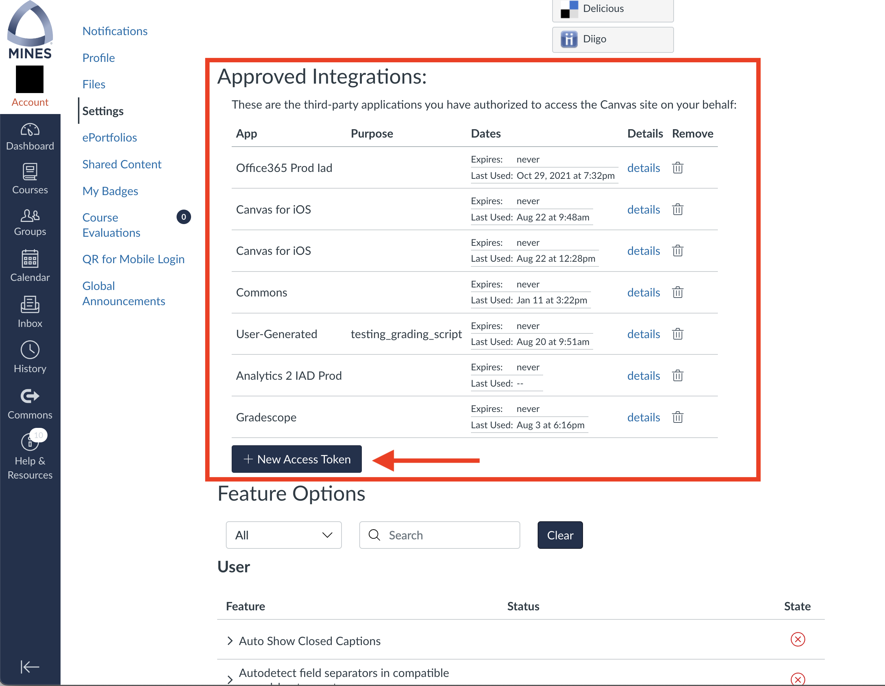
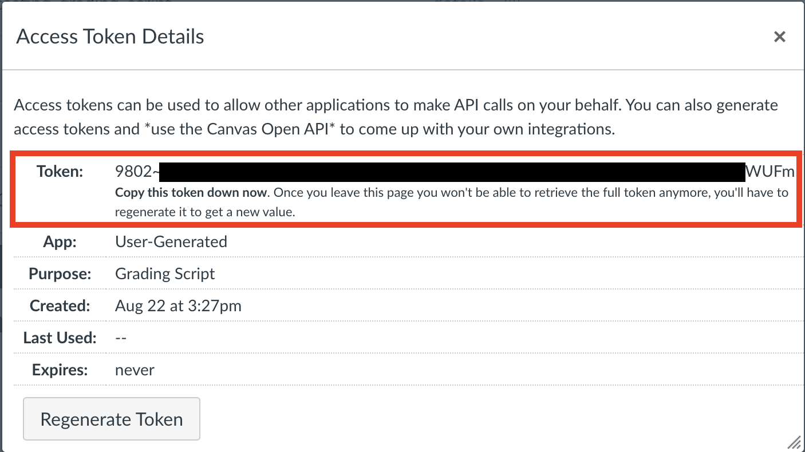
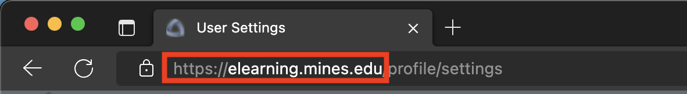

# Getting Started
?> This is a work in progress

Setup of the script is designed to be user-friendly. With that said, specific step must be taken to ensure proper 
operation. 

The general process is: 
1. Generate a Canvas API key
2. Get your user ID and endpoint from canvas 
3. Download the compiled program from [here](https://trihardstudios-my.sharepoint.com/:f:/p/gjbell/Etrkx_32aV1Ntjxta1Uv8U8BcxE4JH3iVwdkpEPJai--zA?e=8GPcyP) for your platform of choice 
4. Create the required folder structure
5. Finally, run the script for the first time to create a config file

## Generating a Canvas API key

To begin, sign in to Canvas for your institution. 

Then go to your account and open the settings pane.

Scroll down to 'Approved Integrations' in Canvas and click 'New Access Token'.

If you have used the Canvas mobile app or any other program with Canvas integration you wil see other 'integrations' 
under that header as shown in the image. 

After pressing 'New Access Token', enter a purpose for the token. This will help you identify the key later. Leave the 
expiration date empty, we don't want this token to expire. 

Press 'Generate Token'

Another window will pop up with the title 'Access Token Details'. It will have a few fields, but the only one of note is
the field 'Token' as this is our API key. Copy this key down in the application of your choice.

!> After you leave this page you will be unable to see the key again. So **make sure** that you have it copied down. 

!> **DO NOT** share this key with **ANYONE**. Treat it like a password.

e
## Finding Your Canvas ID and Endpoint

?> After implementing functionality requiring a Canvas ID, a change was made to Canvas to allow using `self` rather
than an ID. This is now the recommended and supported method.

The easiest way to find your Canvas endpoint is to look at the url you access Canvas from. Typically, it will be 
something like `<myschool>.instructure.com` or `canvas.<myschool>.edu`. Some institutions are wierd and put it at a 
different domain like `elearning.<myschool>.edu`. 

> I did not test this with a locally installed version of canvas, (meaning you are running the Canvas server on your
local machine). So proceed at your own risk in this situation.

To identify your own Canvas endpoint, look at the url that you access Canvas from. The part before (and including) the 
`.com`, `.org`, or `.edu` is the end point. look at the below image for an example. 

Your Canvas ID is `self`. As mentioned briefly above, there used to be a requirement that you have your numeric ID, but 
that is no longer required and you can use `self` instead.

We now have all the information required to make a connection to Canvas. 
To recap - we have:
- Our API key
- Our ID (which is `self`)
- And our endpoint

**Make sure that you have those things before proceeding any further**
