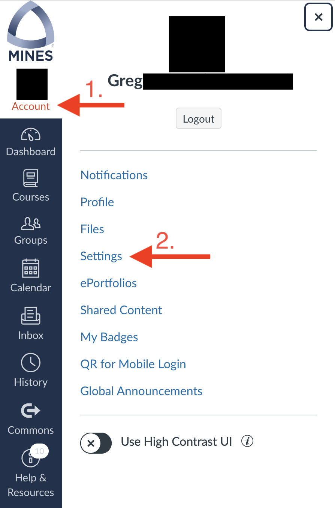
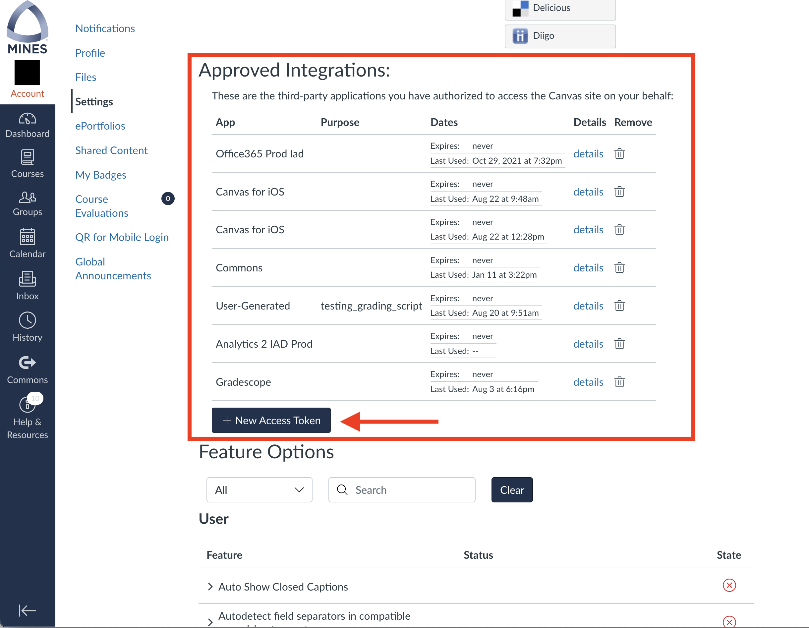
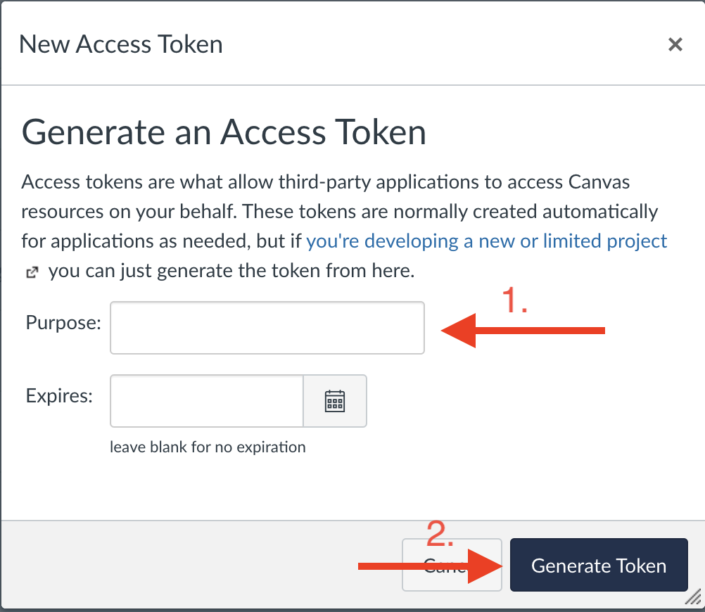
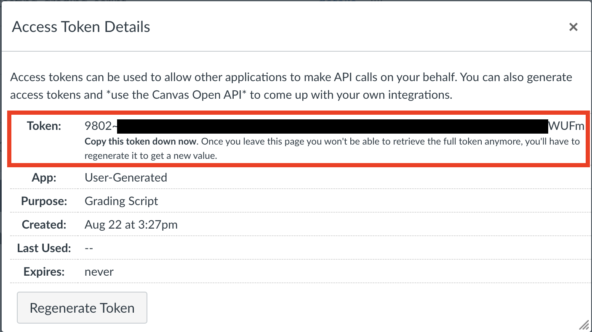
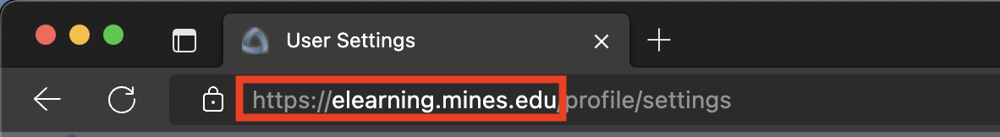
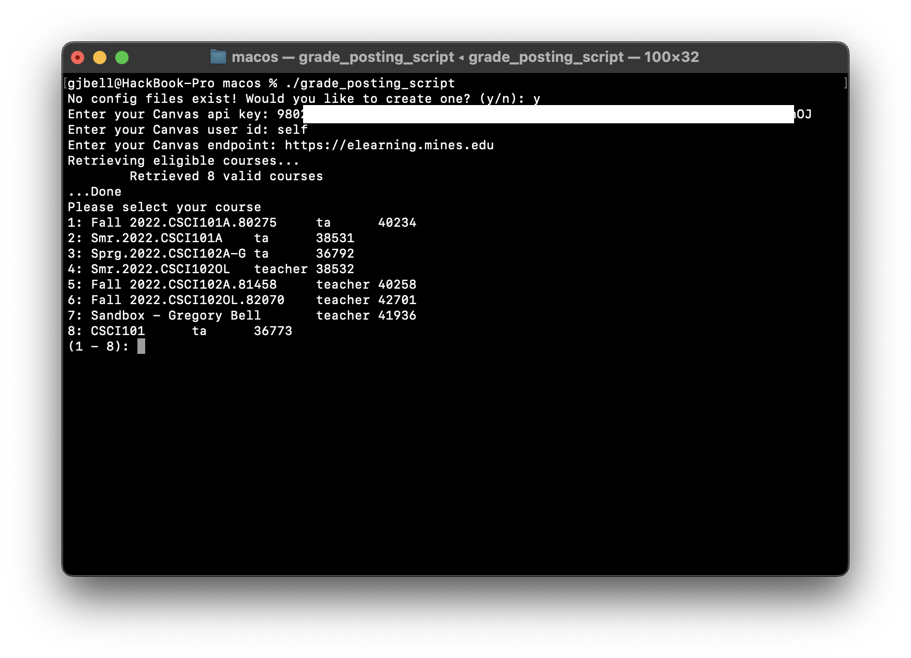
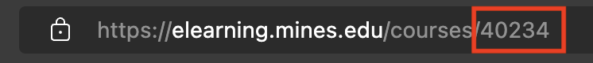
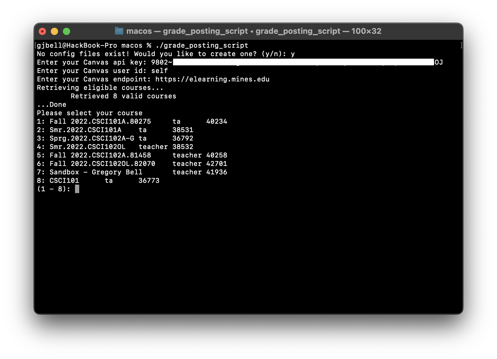
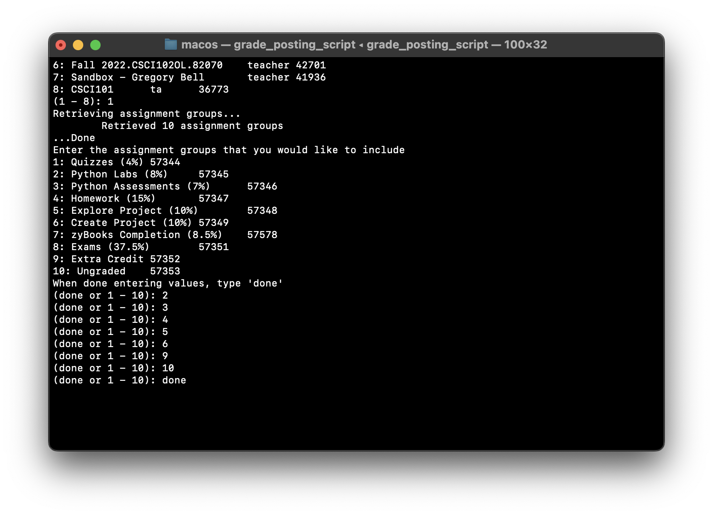
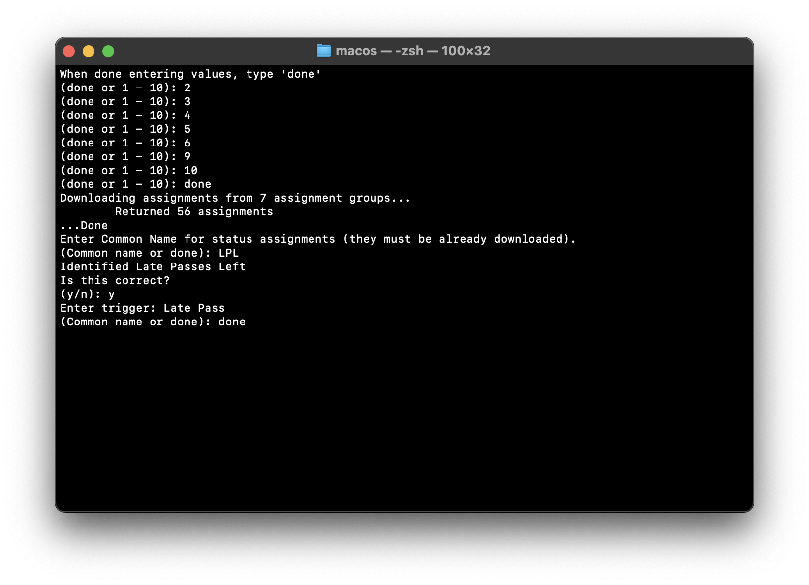

================
Getting Started
================

Setup of the script is designed to be user-friendly. With that said, specific steps must be taken to ensure proper
operation. 

The general process is:

#. Generate a Canvas API key
#. Get your user ID and endpoint from canvas
#. Download the compiled program from `here <https://trihardstudios-my.sharepoint.com/:f:/p/gjbell/Etrkx_32aV1Ntjxta1Uv8U8BcxE4JH3iVwdkpEPJai--zA?e=8GPcyP>`_. for your platform of choice
#. Create the required folder structure
#. Finally, run the script for the first time to create a config file

Generating a Canvas API Key
---------------------------

To begin, sign in to Canvas for your institution. 

Then go to your account and open the settings pane.

Scroll down to 'Approved Integrations' in Canvas and click 'New Access Token'.

If you have used the Canvas mobile app or any other program with Canvas integration you wil see other 'integrations' 
under that header as shown in the image. 

After pressing 'New Access Token', enter a purpose for the token. This will help you identify the key later. Leave the 
expiration date empty, we don't want this token to expire. 

Press 'Generate Token'

Another window will pop up with the title 'Access Token Details'. It will have a few fields, but the only one of note is
the field 'Token' as this is our API key. Copy this key down in the application of your choice.

.. attention::
    After you leave this page you will be unable to see the key again. So **make sure** that you have it copied down.

.. danger::
    **DO NOT** share this key with **ANYONE**. Treat it like a password.

Finding Your Canvas ID and Endpoint
-----------------------------------

.. hint::
    After implementing functionality requiring a Canvas ID, a change was made to Canvas to allow using ``self`` rather
    than an ID. This is now the recommended and supported method.

The easiest way to find your Canvas endpoint is to look at the url you access Canvas from. Typically, it will be 
something like ``<myschool>.instructure.com`` or ``canvas.<myschool>.edu``. Some institutions are wierd and put it at a
different domain like ``elearning.<myschool>.edu``.

To identify your own Canvas endpoint, look at the url that you access Canvas from. The part before (and including) the
``.com``, ``.org``, or ``.edu`` is the end point. look at the below image for an example.

Your Canvas ID is ``self``. As mentioned briefly above, there used to be a requirement that you have your numeric ID, but
that is no longer required, and you can use ``self`` instead.

We now have all the information required to make a connection to Canvas. 
To recap - we have:

* Our API key
* Our ID (which is ``self``)
* And our endpoint

**Make sure that you have those things before proceeding any further**

Downloading and Running the Application
---------------------------------------

Go to this link: `TriHard Studios GitHub Distribution <https://trihardstudios-my.sharepoint.com/:f:/p/gjbell/Etrkx_32aV1Ntjxta1Uv8U8BcxE4JH3iVwdkpEPJai--zA?e=8GPcyP>`_.
and download the version of the script that corresponds to your platform. Extract the downloaded zip in to a folder that
you will remember.

The provided executables were complied on Windows 11 with Python 3.9.13 and macOS 12.3.1 with Python 3.9.7. 
They should work with any version of Python 3 installed, however.

If none of the executables work for you, or you would prefer to run from source (which is my preferred way of running it),
you can download the source code instead.

If you would like to go this route, follow the below instructions. If not, skip to the next section.

I would recommend creating a virtual environment to run the script in. 

This can be accomplished with the command ``python -m venv .venv`` which will create a virtual python environment
in the folder ``.venv``.

After that command finishes, activate the environment. On Windows this is done with the command ``./.venv/Scripts/Activate.ps1``
and on \*nix systems it's done with the command ``source ./.venv/bin/activate``.

After you have created and activated a virtual environment (or not if you don't want to), install the dependencies. This program defines
all its dependencies in the the ``requirements.txt`` and uses pip as its package manager. You can install all the
dependencies with the command ``pip install -r requirements.txt``.

Finally, to run the script, run ``python main.py``.

The Required Folder Structure
-----------------------------

If you downloaded from the above link and extracted the zip, you should already have the required folder structure. But 
check anyway.

Your file structure (not including the source code) **must** look like this::

    (extracted folder)
    |
    |__gradescope
    |   |
    |   |__graded
    |
    |__canvas
    |   |
    |   |__graded
    |
    |__config
    |
    |__(platform executable)

Initial Setup
-------------

.. note::
    I am running the macOS compiled executable

Ok we are now ready to do our initial setup! 

Keep your API key and Canvas endpoint handy.

Run the script (it may take a second to start as Pandas has to initialize a lot of dependencies).

You should see a prompt saying ``No config files exist! Would you like to create one? (y/n):``. If you don't or the program
crashes, make sure that you have the required folder structure set up.

Enter ``y`` at this prompt.

The program will the ask you for your API Key, **copy and paste it** at the prompt.

You will then be prompted for your Canvas User ID, enter ``self``.

Finally, you will be prompted for your Canvas endpoint, **copy and paste it** at the prompt. It must include the ``https://``
and the top level domain. For example, ``https://canvas.<your_school>.edu``.

If you get an error after you enter your information, make sure that it is all typed correctly and that you copied and 
pasted the API key with no spaces at the beginning and the end. Also make sure that the canvas endpoint is correct and 
includes the ``https://`` and does *not* have a slash after the top level domain (``.edu``, ``.com``, etc.)

The script will retrieve the classes that you are listed as **either** a TA or an instructor for. It **will not** retrieve 
student courses. If the course list is empty, you **are not** listed as a TA or an instructor for any of the classes that you 
are enrolled in on Canvas. Reach out to the appropriate channels if you believe this to be a mistake. 

The script will print out a list of courses with course name, your enrollment status (either TA or Teacher), 
and the ID that corresponds with the course. You can verify the ID by looking at the URL of the class when you are on the 
homepage for the course. It is the numbers after the ``/courses/`` in the url.

.. note::
    There are some table formatting errors, depending on the length of the course names, not all the columns will line up
    it is a fairly minor issue, so it has not yet been fixed.

Select the course that you will be posting grades for.

The script will download the assignment groups for the course. 

Select all the assignment groups whose assignments you will be grading throughout the semester typing ``done`` when finished.

The program will download all the assignments from those groups. 

.. note::
    Depending on the number of assignments, this may take a bit to run.

The script will then prompt you do define a status assignment. 

.. note::
    A status assignment is an assignment that is not graded but shows the student the amount of something that they have left.
    For example, In one of my courses we have 5 'Late Passes' allowing us to turn in an assignment a day later per late pass.
    The amount that I have remaining is shown to me in Canvas an assignment called Late Passes Left.

If your course does not keep track of this type of extension, simply type ``done`` and no status assignments will be generated.

If your class does use this type of assignment, enter its common name and trigger. I will go in to more detail about what 
a common name actually is in :doc:`common_names`. The trigger is what will be entered in the special case spreadsheet
to actually update the statu assignment. I will go into the required file structure for the special cases spreadsheet 
:doc:`special_cases`

.. warning::
    Currently the script only supports decrementing the status assignment by the number of days specified in the spreadsheet.

After entering the status assignments, the program will ask you to press any key to write to file. 
If the information you entered throughout the program is correct, press any key, otherwise, press ``control + c`` to stop
execution.

The program will then write the new config file to disk and load up the course. 

After it downloads the current roaster and updates status assignments, press ``3`` if you are not going to be grading.
Otherwise, see :doc:`grading` for more information about how the grading process works with this script.
